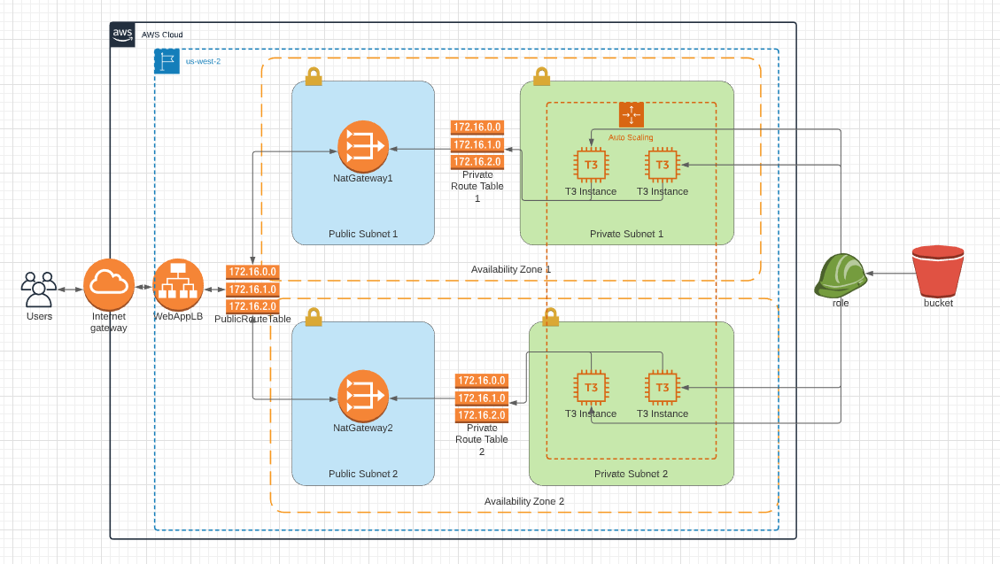

# Deployment of an high availability webapp on AWS cloud

## Description

This project aims to deploy an high availability webapp on AWS cloud thanks to the CloudFormation module.
It is part of the Cloud Devops Engineer Nanodegree Program of Udacity.

## Prerequisite

- [AWS CLI version 2](https://docs.aws.amazon.com/fr_fr/cli/latest/userguide/install-cliv2.html "Install AWS CLI") installed on your computer

## Stack

- YAML: describes the infrastructure (network and server)
- JSON: contains parameters of the infrastructure

## Deploy

```cmd
aws cloudformation create-stack --stack-name cfhaStack --template-body file://cf-ha-webapp.yml --parameters file://cf-ha-webapp.json --capabilities "CAPABILITY_IAM" "CAPABILITY_NAMED_IAM" --region=us-west-2
```

## Infrastructure



## Interesting config elements

Image is an Ubuntu Server 18.04 LTS (HVM), SSD Volume Type:

```yaml
ImageId: ami-0ac73f33a1888c64a
```

The code you deploy on each server of the AWS Autoscaling Group is given here:

```yaml
Properties:
    UserData:
    Fn::Base64: !Sub |
        #!/bin/bash
        apt-get update -y
        apt-get install unzip awscli -y
        apt-get install apache2 -y
        systemctl start apache2.service
        cd /var/www/html
        aws s3 cp s3://udacity-demo-1/udacity.zip .
        unzip -o udacity.zip
```

Example with simple static Hello World

```yaml
Properties:
    UserData:
    Fn::Base64: !Sub |
        #!/bin/bash
        apt-get update -y
        apt-get install apache2 -y
        systemctl start apache2.service
        cd /var/www/html
        echo "Hello World!" > index.html
```

